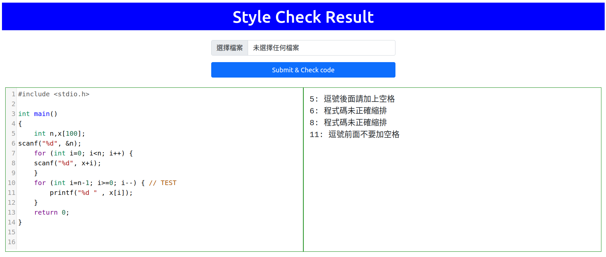

# CodeStyle

本專案使用 Go 語言及 [Vera++](https://bitbucket.org/verateam/vera/wiki/Home) 原始碼建置一個簡易的網站，可以用來上傳 C/C++ 程式碼，並檢查程式碼是否符合一些基本的排版規則，操作圖示如下：



預設檢查的項目包括以下規則：

1. L003: 檔案最前面及最後面不能出現太多空白列
2. L005: 檔案中間不能出現太多空白列
3. T003: 特定關鍵字後面 (如 case) 後面應接單一空格 
4. T004: 特定關鍵字後面 (如 default) 應緊接著冒號
5. T005: 特定關鍵字後面 (如 break) 應緊接著分號
6. T006: 特定關鍵字後面 (如 return) 應緊接著分號或單一空格
7. T009: 逗點前面不要放空格，逗點後面應該接空格
8. T011: 不同行的大括號內部區塊應該要有適當縮排

## 使用方式

根據各自的需要可使用以下不同方式執行程式碼：

1. 直接使用以下 docker 指令執行，執行之後開啟瀏覽器輸入網址 http://localhost:8080 即可開啟頁面。
```bash
docker run -it --rm -p 8080:8080 jywglady/codestyle:1.0
```

2. 自行建置 image 並執行
先 clone 本專案並進入專案目錄，然後開啟終端機使用以下指令：
```bash
docker build -t codestyle .
docker run -it --rm -p 8080:8080 codestyle
```

3. 對程式碼進行開發及修改
先 clone 專案並進入專案目錄，用 VSC 開啟專案，並開啟終端機執行以下指令：
```bash
docker build -t codestyle .
docker run -it --rm -p 8080:8080 -v "$PWD":/home/root/app/dev codestyle bash
```

接下來可用 VSC 編修專案，並在容器中使用以下指令觀察執行結果：
```
cd dev
go run *.go
```
容器中可用 CTRL+C 中斷執行，用 `go run *.go` 再次執行專案。專案編修過程可反覆編修及觀察執行結果。

## 版權說明

- 本專案使用了 [Vera++](https://bitbucket.org/verateam/vera/wiki/Home) 的原始碼，這部份的相關版權請參照該網頁之說明。

- 本專案其餘的程式碼，歡迎有興趣的使用者自行運用，敬請引述本專案之 Github 網址，謝謝。

  
